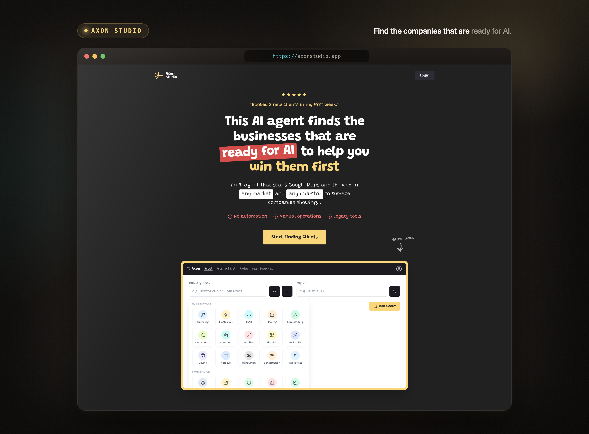
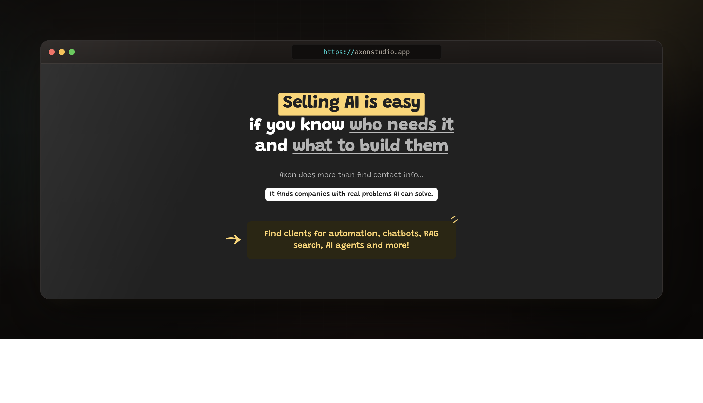
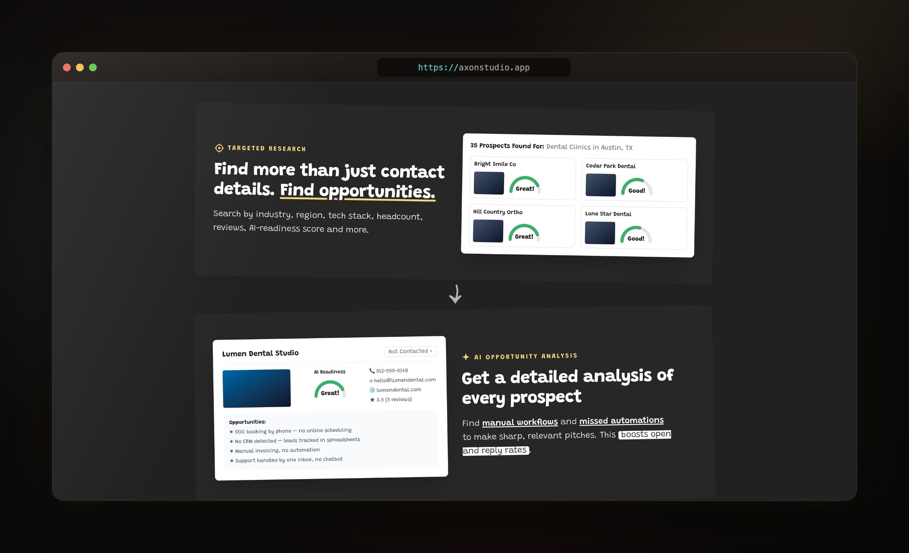
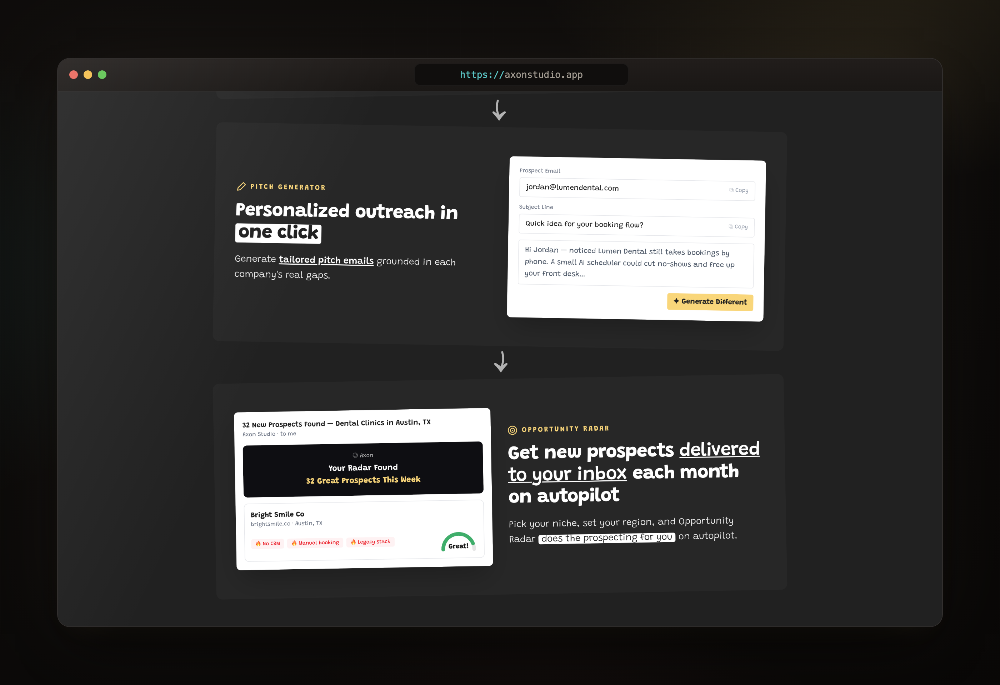
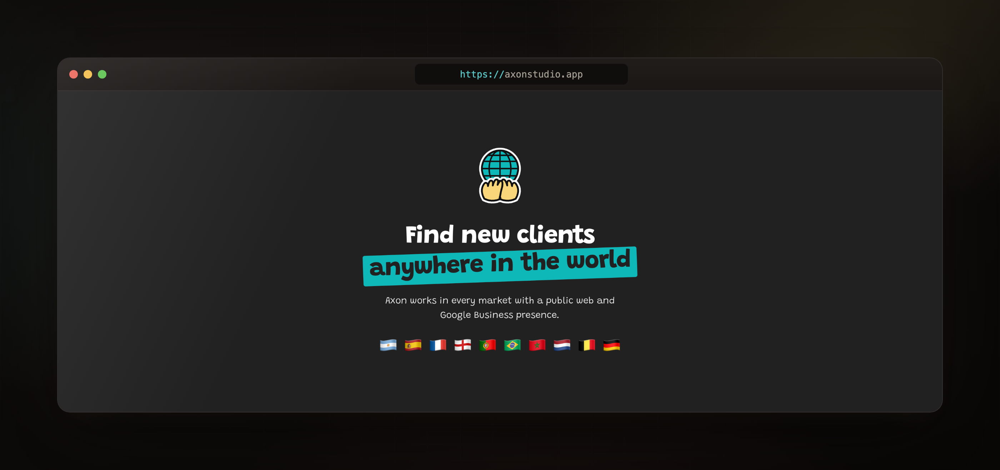
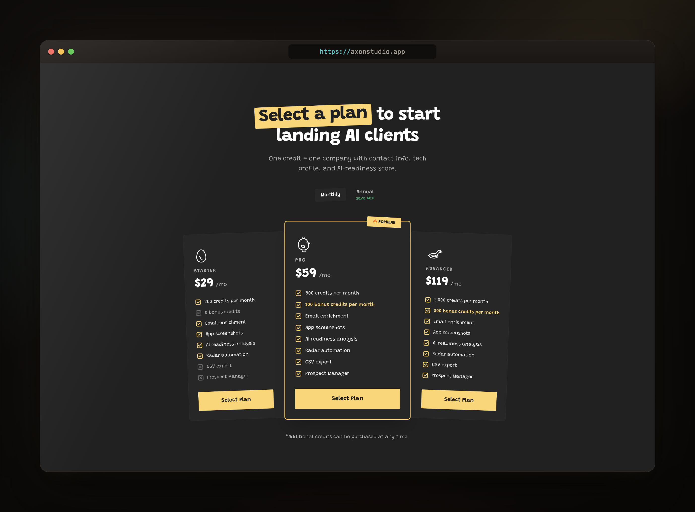
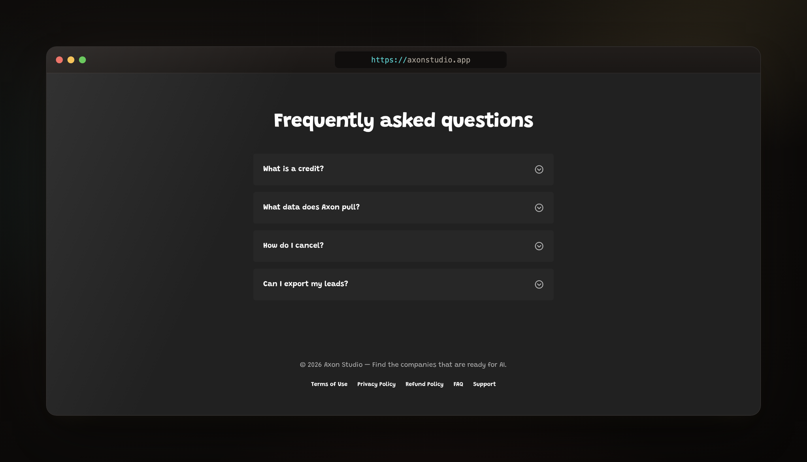

# Axon Studio

A landing-page build for **Axon** — a fictional AI agent that scans Google Maps and
the web to find businesses _ready to adopt AI_, scores their AI-readiness, and helps
agencies pitch the right companies first.

<p align="center">
  
</p>

> Layout cloned 1:1 from [uglysitescraper.com](https://uglysitescraper.com) as a design
> study. All copy is original; the company is fictional.

## Stack

- **React 19** + **TypeScript**
- **Vite 8** — dev server & build
- **Tailwind CSS v4** (`@tailwindcss/vite`)
- **React Router 7** — Home / Login / Register
- **Hugeicons** · **Oxlint** · **Prettier**

## Run

```bash
pnpm install
pnpm dev        # http://localhost:5173
pnpm build      # type-check + production build
```

## Sections

One component per section (`src/components/`).

**Value proposition** — `ValueProp`


**Targeted research & AI analysis** — `Features`


**Pitch generator & Opportunity Radar** — `Features`


**Worldwide coverage** — `Worldwide`


**Pricing** — `Pricing`


**FAQ & footer** — `Faq` · `Footer`


---

Part of the [ui-snips](../README.md) collection.
